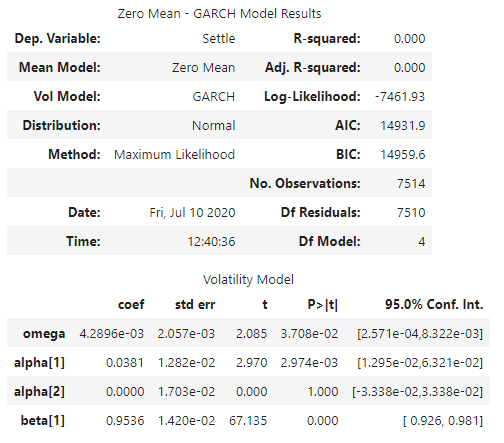

#Unit 10 HW 
## A Yen for the Future
### Alex Waters 7/12/20
---
**Time-Series Forecasting**

Question:  Based on the plot above, we can see a long-term strengthening of the Japanese Yen against the Dollar. There do seem to be some more medium, 1-3 year consistent trends, but on a daily basis, there are a lot of short-term ups and downs.

Answer:  Overall trajectory over the span of the dat is generally an up trend with some significant peaks and then drops.
---
*Hodrick-Prescott Filter*

The settle and trend price are very closely matched.

---
*ARMA*

Notice that the p value is not less than .05.

---
*ARIMA*

Notice p value is greater than .05.

The value of the yen appears to be rising over the next 5 days.
---
*GARCH*

The p value for omega and alpha[1] are much less than .05.

Based on the upward trend of the forecast the volatility looks to increase.
---

**Linear Regression Forecasting**

rmse for in-sample:  0.5665389565201941 
rmse for out-of-sample: 0.4152118225942089
The out of sample rmse is less than .5 as is a better model, but a lower rmse would have been preferable.